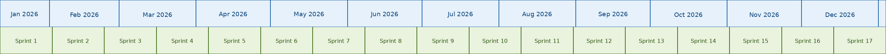
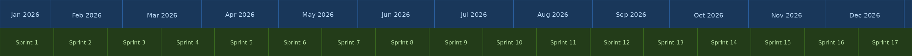
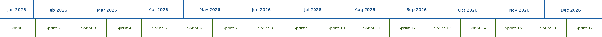

# timestrip

Generate timeline strip images for project planning. A single-file web app with live preview — no server required. Useful for slide decks, dashboards, and planning documents.



## Usage

Open `index.html` in a browser, or serve it:

```bash
python3 -m http.server 8080
# then open http://localhost:8080
```

Everything runs client-side. No dependencies, no build step.

## Features

- **Live preview** — changes update instantly as you edit settings
- **22 built-in themes** — light, dark, nord, dracula, catppuccin, mint, and more
- **Custom colors** — override any theme color with a color picker
- **Configurable intervals** — sprints, quarters, or any custom period
- **Auto or custom intervals** — auto-generate from a length + start number, or define each one manually
- **Guidelines** — dotted vertical lines at interval boundaries
- **Padding** — top/right/bottom/left padding for precise slide positioning
- **Transparent backgrounds** — for layering on slides
- **PNG and SVG export** — raster or vector output
- **Save/Load JSON** — export and import configs
- **Shareable URLs** — config encoded in the URL for sharing

## Themes

22 built-in themes:

`catppuccin-latte` `catppuccin-mocha` `dark` `dracula` `forest` `github-dark` `github-light` `gruvbox-dark` `gruvbox-light` `high-contrast` `light` `mint` `monokai` `nord` `ocean` `one-dark` `one-light` `pastel` `solarized-dark` `solarized-light` `sunset` `tokyo-night`





## Config JSON

Settings can be saved/loaded as JSON. All fields are optional except dates.

```json
{
  "timeline_start": "2026-01-12",
  "timeline_end": "2027-01-04",
  "interval_days": 21,
  "interval_start_number": 1,
  "interval_label": "Sprint {n}",
  "month_label": "{month} {year}",
  "width": 2559,
  "strip_height": 160,
  "height": 1440,
  "padding": { "top": 120 },
  "theme": "light",
  "transparent": false,
  "guidelines": true,
  "guidelines_bg": "transparent",
  "font_size_lg": 18,
  "font_size_sm": 16,
  "colors": {
    "month_bg": [200, 220, 255],
    "interval_border": [100, 100, 100]
  }
}
```

### Label Placeholders

**Interval labels:** `{n}` — interval number

**Month labels:** `{month}` (Jan), `{month_full}` (January), `{mm}` (01), `{m}` (1), `{year}` (2026), `{yy}` (26)

### Keyboard Shortcuts

| Shortcut | Action |
|----------|--------|
| `Ctrl+S` | Save JSON |
| `Ctrl+D` | Download |

## License

MIT
